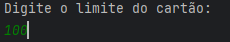
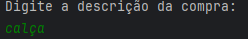
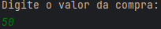
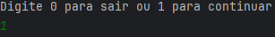
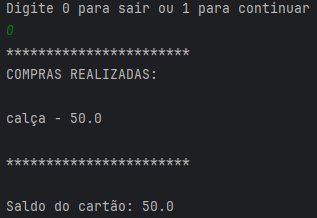
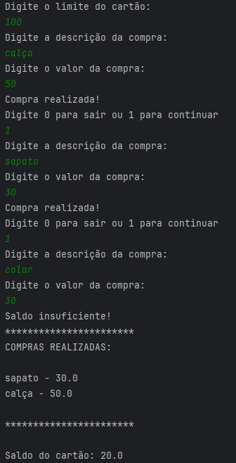

# 💳 Desafio Alura - Lista de Compras 💳

---
#### 🚩 G7 ONE | Java e Orientação a Objetos | Java: trabalhando com listas e coleções de dados 🚩
#### 🌎 [@Alura](https://www.alura.com.br/) | [@One](https://www.oracle.com/br/) 

---
### Descrição
1. **Classe compra:** _Criar uma classe para representar uma compra_
2. **Cartão de crédito:** _Criar uma classe para representar um cartão de crédito, que possua_ **(limite, saldo e lista de compras)**, _e deve possuir um método para registrar uma compra._
3. **Criar classe com o método main, seguindo os seguintes objetivos:**
   1. _Solicitar que o usuário informe o limite do cartão de crédito_;
   2. _Criar um objeto cartão de crédito com o limite informado_;
   3. _Solicitar que o usuário informe a descrição e o valor da compra_;
   4. _Criar um objeto compra com a descrição e valor informados_;
   5. _Registrar a compra no cartão de crédito e imprimir na tela se ela foi realizada ou não (de acordo com o saldo remanescente)_;
   6. _Perguntar se o usuário deseja registrar uma nova compra ou finalizar_;
   7. _Caso ele deseje continuar, repetir os passos de 3 a 6, caso não, imprimir na tela o saldo final do cartão e a lista de compras realizadas, ordenadas pelo valor_.

---
## Índice

> -  [Inserir limite](#1-inserir-limite-)
> -  [Produto](#2-descrição)
> -  [Valor](#3-valor)
> -  [Continuar compra](#4-continuar-compra)
> -  [Lista de compras](#5-tela-final)

---
## Tela inicial
### 1. *Inserir limite:* 
_Ao executar o programa você deverá inserir o limite que deseja no cartão para efetuar as compras._

>   

### 2. *Descrição:*
_Em seguida na descrição você deverá informar qual o nome do item que irá comprar._

>   

### 3. *Valor:*
_Insira o valor do item para a compra._

> 

### 4. *Continuar compra:*
_Após inserir todos os itens pedidos acima, você terá a opção em escolher se deseja continuar comprando pressionando o número `1` ou caso deseje encerrar, pressione o número `0` desta forma parando com a lista de compras._

> 

> 

### 5. *Tela Final:*
_Após atingir o limite do cartão com as compras ou tentando adicionar algum item acima do valor limite do cartão, a aplicação se encerrará automaticamente lhe mostrando a lista com todas as compras realizadas até o momento por ordem crescente de preço, e também mostrará o saldo restante do cartão._

> 
